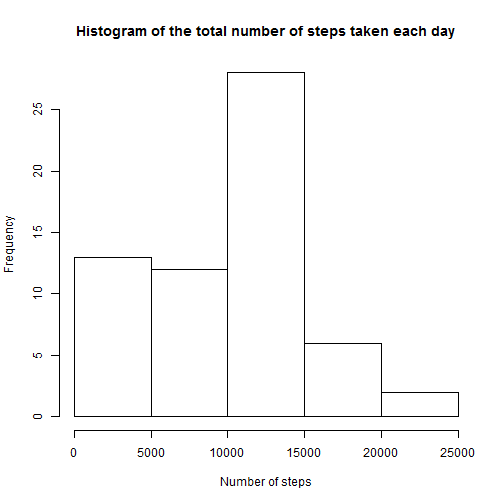
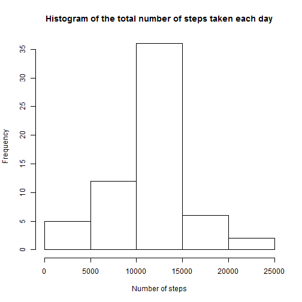
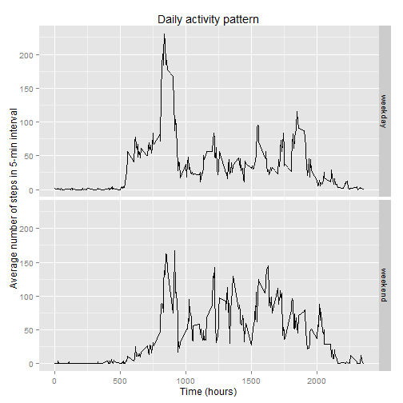

# Data


##Preparing the data


#### Downloading the data

```r
if(!file.exists("./data")){dir.create("./data")}
fileUrl <- "http://d396qusza40orc.cloudfront.net/repdata%2Fdata%2Factivity.zip"
download.file(fileUrl,destfile="./data/Dataset.zip")
```

#### Unzip the data

```r
unzip(zipfile="./data/Dataset.zip",exdir="./data")
```

#### Get the file name(s)

```r
path_rf <- file.path("./data")
files <- list.files(path_rf, recursive=TRUE)
files
```

```
## [1] "activity.csv" "Dataset.zip"
```


##Reading the data file into R


####Read the Activity csv file

```r
dataActivity  <- read.csv(file.path(path_rf, "activity.csv"),header = TRUE)
```

####Checking the data properties

```r
str(dataActivity)
```

```
## 'data.frame':	17568 obs. of  3 variables:
##  $ steps   : int  NA NA NA NA NA NA NA NA NA NA ...
##  $ date    : Factor w/ 61 levels "2012-10-01","2012-10-02",..: 1 1 1 1 1 1 1 1 1 1 ...
##  $ interval: int  0 5 10 15 20 25 30 35 40 45 ...
```

```r
dataActivity$date <- as.Date(dataActivity$date, format = "%Y-%m-%d")
```

####Attach the data

```r
attach(dataActivity)
```

```
## The following object is masked _by_ .GlobalEnv:
## 
##     interval
## 
## The following objects are masked from dataActivity (pos = 3):
## 
##     date, interval, steps
## 
## The following objects are masked from dataActivity (pos = 4):
## 
##     date, interval, steps
## 
## The following objects are masked from dataActivity (pos = 5):
## 
##     date, interval, steps
## 
## The following objects are masked from dataActivity (pos = 6):
## 
##     date, interval, steps
## 
## The following objects are masked from dataActivity (pos = 9):
## 
##     date, interval, steps
## 
## The following objects are masked from dataActivity (pos = 10):
## 
##     date, interval, steps
## 
## The following objects are masked from dataActivity (pos = 11):
## 
##     date, interval, steps
## 
## The following objects are masked from dataActivity (pos = 12):
## 
##     date, interval, steps
## 
## The following objects are masked from dataActivity (pos = 14):
## 
##     date, interval, steps
```


#Analysis


##Steps per day


####Total number of steps per day

```r
datesum <- tapply(steps, date, sum, na.rm=TRUE)
```

####Histogram

```r
hist(datesum, xlab = "Number of steps", main = "Histogram of the total number of steps taken each day")
```

 

####Mean and Median of the Total number of steps per day

```r
mean(datesum)
```

```
## [1] 9354.23
```

```r
median(datesum)
```

```
## [1] 10395
```
#####The mean and median of the total number of steps taken per day are 9354.23 and 10395 respectively.


##Daily pattern


####Average number of steps in each 5-minute intervals

```r
intervalave <- tapply(steps, interval, mean, na.rm = TRUE)
```

####Time series plot (i.e. type = "l") of the 5-minute interval (x-axis) and the average number of steps taken, averaged across all days (y-axis)

```r
hours <- as.numeric(names(intervalave))
plot(hours, intervalave, type="l", xlab="Time (hours)", ylab="Average number of steps in 5-min interval", main="Daily activity pattern")
```

 

####5-minute interval which contains the maximum number of steps on average across all the days

```r
names(which.max(intervalave))
```

```
## [1] "835"
```
#####Maximum number of steps on average across all the days occured at 8:35hr.


##Inputting missing values


####Total number of missing values in dataset

```r
na_number <- sum(!complete.cases(steps))
na_number
```

```
## [1] 2304
```
#####The total number of missing values in dataset is 2304.


####Imputing data

#####The daily activity pattern can be used to impute these missing values. For every missing value in the orignial data set the average number of steps in that 5-minutes interval is used. This assumes that the person follows a daily routine.

```r
clean_data <- transform(dataActivity, steps=ifelse(is.na(steps), intervalave, steps))
```

####Histogram of cleaned data

```r
clean_datesum <- tapply(clean_data$steps, clean_data$date, sum, na.rm = TRUE)
hist(clean_datesum, xlab = "Number of steps", main = "Histogram of the total number of steps taken each day")
```

 

####Mean and Median of the Total number of steps per day

```r
mean(clean_datesum)
```

```
## [1] 10766.19
```

```r
median(clean_datesum)
```

```
## [1] 10766.19
```
#####The mean and median of the total number of steps taken per day are 10766.19 and 10766.19 respectively. 

#####The mean and median of the clean data are now identical. The shape of two histograms also differed, most noticeably for the number of steps below 10000. The imputation of the missing data had resulted in an increase of both the mean and median of total number of steps taken per day, with the mean having a larger increase of 1411.96 (15.09%) than the increase of median by 371.19 (3.57%).


##Activity patterns of weekdays and weekends


####Indicate whether each date is a weekday or weekend

```r
week <- factor(weekdays(clean_data$date) %in% c("Saturday","Sunday"), labels=c("weekday","weekend"), ordered=FALSE)
cleansteps <- aggregate(clean_data$steps, by=list(interval=clean_data$interval, weekday=week), mean)
```

####Panel plots - A comparison between Weekdays and Weekends

```r
library(ggplot2)
g <- ggplot(cleansteps, aes(interval, x))
g + geom_line() + facet_grid(weekday ~ .) +
    labs(y="Average number of steps in 5-min interval") +
    labs(x="Time (hours)") +
    labs(title="Daily activity pattern")
```

 
